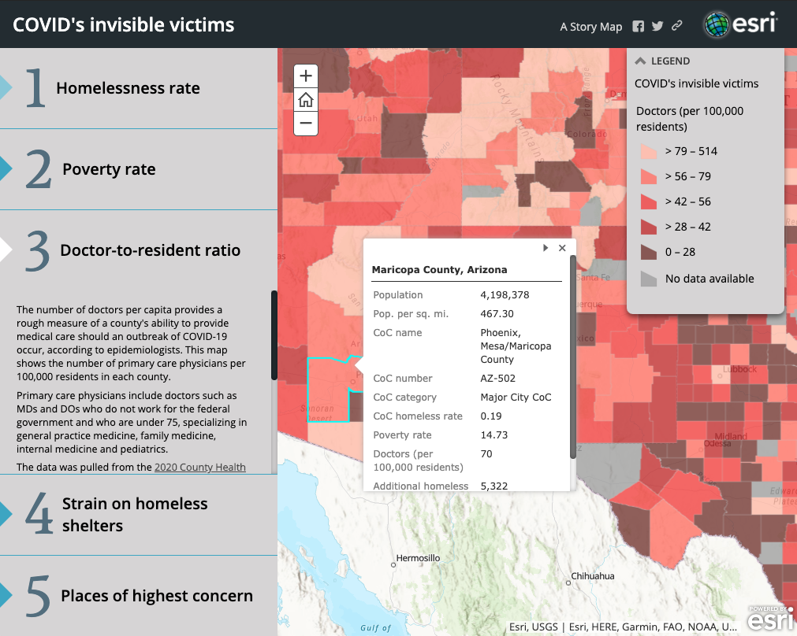

## Readme

A team of researchers at the University of Pennsylvania, Boston University and UCLA [produced a report in early April](https://www.sp2.upenn.edu/the-impact-of-covid-19-on-homelessness/) predicting the coronavirus pandemic could kill more than 3,400 people experiencing homelessness across the country.

They predict coronavirus may hospitalize 4.3% of the nationwide homeless population (21,295 people), with nearly 7,200 of them requiring critical care.

This document shows how I combined multiple datasets and then narrowed down 3,142 counties to see which might have the biggest problem protecting people experiencing homelessness. The 42 counties selected are most likely, considering they possess all the following variables:  

* High rates of homelessness per capita (according to CoC population totals computed using an R program [supplied by a Boston University researcher](https://github.com/tomhbyrne/HUD-CoC-Geography-Crosswalk));
* High rates of poverty using county-level data poverty data from the [2014-2018 American Community Survey](https://www.census.gov/programs-surveys/acs/); 
* Low rate of primary care physicians (MDs/DOs) to residents (according to the [2020 County Health Rankings](https://www.countyhealthrankings.org/explore-health-rankings/rankings-data-documentation)); and
* Large number of additional shelter beds needed to accommodate social distancing (from the [UPenn study](https://www.sp2.upenn.edu/the-impact-of-covid-19-on-homelessness/))

Many of them overlap with the top cities where the UPenn team anticipated the homeless would be most impacted, but this really helps us narrow down specific counties in those large "balance of state" continuums of care (e.g., Texas has 216 counties in its Balance of State CoC; Indiana has 91, etc.).  

I used Jenks natural break and quantile classification to establish the thresholds to filter the data.

**<a href="https://asu.maps.arcgis.com/apps/MapSeries/index.html?appid=c682e07e717c4317a549ef44fd2b7e0f" target="_blank">Review the ArcGIS map here</a> for full details.** 


```{r include=FALSE}
knitr::include_graphics
knitr::opts_chunk$set(warning = FALSE, message = FALSE)
```
## Loading packages, storing Census key, defining functions
```{r}
library (tidyverse)
library (readxl)
library (janitor)
library (readr)
library (tidycensus)
library(classInt)
library(sf)
library(ggplot2)
library(berryFunctions)

census_api_key("a270041de8c83fd7f8e23dcd703d0ad06ee90804")

#Defining Jenks breaks function
mutate_jenks_brks <- function(input, variable, ...) {
  var_string <- deparse(substitute(variable))
  # var_name <- enquo(variable)
  
  # add breaks
  jenks <- classIntervals(input[[var_string]], style = "jenks", ...)$brks
  
  if (any(0 == jenks)) brk_vec <- jenks
  else brk_vec <- c(0,jenks)
  
  # set labels
  lab_length <- length(brk_vec) - 1
  brk_labs <- vector(mode = "character", length = lab_length)
  
  # create labels dependent on the number of breaks specified
  for (i in seq(lab_length)) {
    
    if (any(brk_vec %% 1 != 0)) {#rounding to 2 decimal places
      brk_labs[i] <- paste0(round(brk_vec[i], 2), "-", round(brk_vec[i + 1], 2))
      
    } else if (any(brk_vec %% 1 == 0)) {
      brk_labs[i] <- paste0(brk_vec[i], "-", brk_vec[i + 1])
      
    }
  }
  
  # create labels using `cut()`
  input[[paste0(var_string, "_brks")]] <-
    cut(input[[var_string]],
        breaks = brk_vec,
        labels = brk_labs,
        include.lowest = TRUE)
  
  return(input)
  
  # labels can be changed directly by levels(input$variable) <- c("here","there","somewhere", ...)
  
}
```

## Loading CoC-level data
The U.S. Department of Housing and Urban Development (HUD) does not maintain county-level counts of people experiencing homelessness to easily compare to our other county-level variables, so I updated Tom Byrne's R program that [creates a crosswalk table](https://github.com/tomhbyrne/HUD-CoC-Geography-Crosswalk) between CoCs and counties. His program was based on 2017 CoC boundaries, but I used the 2019 CoC shapefile and 2019 census tracts and counties to account for slight changes in the intervening two years.

CoCs can match to multiple counties, and a single county can match to each CoC. Thus, the crosswalk has one row for each unique county-CoC combination. Not all counties match to a CoC, as some regions aren't covered by HUD's CoC system.

Essentially, this program applied the CoC homeless rate to each county within its borders, but this should be interpreted with care because counties belonging to geographically larger CoCs will appear worse than they likely are. Homelessness is likely concentrated in urban areas of those CoCs but applied equally to all counties by this model. The other county-level variables will weed out any false positives. 

This program also created a count of each CoC's total population based on tract-level total population estimates from the U.S. Census Bureau's American Community Survey 2013-2018 5-Year Estimates.

```{r}
# Read in CoC-level predictions from UPenn study provided by Dan Treglia
# More info at UPenn COVID19 dashboard - https://github.com/tomhbyrne/covid19_homeless_dashboard
coc_df <- read_excel("data/CoCHomeless2019_formatted20200320.xlsx") %>% clean_names() %>%
  rename( coc_number = co_c_number,
          coc_name = name) %>%
  select (-(co_c_number_and_name))%>%
  mutate(total_new_shelter_beds_required = as.integer(total_new_shelter_beds_required))

# Read in estimated homeless rates from 2017 study by Glynn and Byrne
# More info at https://github.com/G-Lynn/Inflection/blob/master/CoC_Cluster.csv
coc_cluster <- read_csv("data/CoC_Cluster.csv") %>% clean_names() %>%
  rename( coc_number = co_c_number,
          coc_name = co_c_name,
          coc_pop_2017 = co_c_total_population,
          est_homeless_2017 = estimated_homeless_rate_percent) %>%
  select (-c(coc_name, zri_as_percent_of_median_income, percent_of_co_c_living_in_extreme_poverty, cluster_number))

# Read in 2019 Point in Time count from HUD
# Available at https://www.hudexchange.info/resource/3031/pit-and-hic-data-since-2007/
pit_2019 <- read_csv("data/2019_pit.csv") %>% clean_names() %>%
  rename( coc_number = co_c_number,
          coc_name = co_c_name,
          coc_category = co_c_category,
          pit_count_from_2019 = total_homeless_2019) %>%
  select( coc_number, coc_category, pit_count_from_2019)

#Read in 2019 CoC total populations calculated with Byrne's R program
coc_2019 <- read_csv("data/coc_population_2019.csv")
```

## Cleaning up CoC data

Here I calculate each CoC's estimated homeless rate for 2019 by dividing the 2019 PIT count by the 2019 CoC total population. 

In 2017, the researchers adjusted each CoC's rate to account for error and missing values, so I applied the same multiple to approximate 2019's rate. Perhaps could be refined. 
```{r}
# Create my own raw 2017 homeless rate, determine the multiple the researcher used to adjust and determine their rate, and join in 2019 total population data.
coc_cluster <- coc_cluster %>%
  mutate (raw_2017_rate = ((pit_count_from_2017/coc_pop_2017)*100),
          homeless_multiple = ((est_homeless_2017 - raw_2017_rate)/est_homeless_2017)) %>%
  right_join(coc_2019, by="coc_number") %>%
  rename ( coc_pop_2019 = total_population, 
           coc_pop_in_pov_2019 = total_pop_in_poverty)

# Fix Kansas City CoC Number
coc_df <- coc_df %>%
  mutate(coc_number = str_replace(coc_number, "MO-604a","MO-604"))

# Join Treglia's CoC info with Byrne's estimates
coc_df_2 <- coc_df %>%
  full_join(coc_cluster, by="coc_number") 

# Join 2019 PIT count data to our data frame
coc_df_3 <- coc_df_2 %>%
  full_join(pit_2019, by="coc_number") 

# Calculate raw 2019 homeless rate and a scaled rate using 2017's multiple
coc_df_3 <- coc_df_3 %>%
    mutate (est_homeless_2019 = ((pit_count_from_2019/coc_pop_2019)*100),
            est_homeless_2019_scal = (est_homeless_2019 * (1 + homeless_multiple)))

# Fixing errors created in CoCs without a 2017 homeless rate
coc_df_3 <- coc_df_3 %>%
    mutate (est_homeless_2019_scal = if_else(coc_number == "CA-527", est_homeless_2019, est_homeless_2019_scal),
            est_homeless_2019_scal = if_else(coc_number == "CA-529", est_homeless_2019, est_homeless_2019_scal),
            est_homeless_2019_scal = if_else(coc_number == "CA-530", est_homeless_2019, est_homeless_2019_scal),
            est_homeless_2019_scal = if_else(coc_number == "CA-531", est_homeless_2019, est_homeless_2019_scal),
            est_homeless_2019_scal = if_else(coc_number == "NJ-512", est_homeless_2019, est_homeless_2019_scal),
            est_homeless_2019_scal = if_else(coc_number == "NY-525", est_homeless_2019, est_homeless_2019_scal),
            est_homeless_2019_scal = if_else(coc_number == "GA-502", est_homeless_2019, est_homeless_2019_scal),
            est_homeless_2019_scal = if_else(coc_number == "GA-508", est_homeless_2019, est_homeless_2019_scal),
            )

# Cleaning up presentation
coc_df_3 <- coc_df_3 %>%
  select(coc_number, coc_name, coc_category, coc_pop_2019, est_homeless_2019_scal, pit_count_from_2019, coc_pop_in_pov_2019, observed_unsheltered_homeless:total_additional_cost )

coc_df_3 %>% print
```

## Loading county-level data

The University of Pennsylvania research team produced predictions of additional shelter beds needed to accommodate social distancing the single adult homeless population within each county. I used OCR to read them from the [end of this study](https://endhomelessness.org/wp-content/uploads/2020/03/COVID-paper_clean-636pm.pdf).
 
Since their table lacks FIPS codes, I joined FIPS into their county-level predictions. 

Then I loaded the primary care physician rate from 2020's [2020 County Health Rankings](https://www.countyhealthrankings.org/explore-health-rankings/rankings-data-documentation)) and county-level poverty data produced by the [2014-2018 American Community Survey](https://www.census.gov/programs-surveys/acs/). 

The County Health Rankings are compiled by the Robert Wood Johnson Foundation and the University of Wisconsin Population Health Institute each year. Primary care physicians include practicing non-federal physicians (M.D.s and D.O.s) under age 75 specializing in general practice medicine, family medicine, internal medicine, and pediatrics. The 2020 rankings include the most recent figures (2017), and I chose the rate per 100,000 residents to account for counties without a single MD/DO.

Currently, poverty means a single person earns less than \$12,760 in a year. That figure increases about $4,480 for each dependent or child they provide for, according to the [U.S. Department of Health and Human Services](https://aspe.hhs.gov/2020-poverty-guidelines).

My 2019 crosswalk table allowed me to join all this county-level data to the CoC data above. 

```{r}
fips <- read_csv("data/fips-state-county.csv", col_types = cols(FIPS = col_character())) %>% 
  clean_names()

# Clean up Virginia's city problem
fips <- fips %>%
  mutate(county = str_remove(county," City")) %>%
  mutate(county = if_else(fips=="32510", "Carson City", county),
         county = if_else(fips=="51036", "Charles City", county),
         county = if_else(fips=="51095", "James City", county)
         )

# Read in dditional shelter beds needed by county produced by University of Pennsylvania and clean up county name issues
county_beds <- read.csv("data/county_bed_need.csv") %>% 
  clean_names() %>%
  mutate(state = str_replace(state, "Columbia","District of Columbia"),
         county = str_replace(county, "Hyder","Prince of Wales-Hyder"),
         )

# Read in 2020 County Health Rankings data
county_doctors <- read_csv("data/physicians-per-capita-county-level-integer.csv") %>% 
  clean_names %>%
  rename (county_fips = fips) %>%
  select (county_fips, primary_care_physicians_rate, primary_care_physicians_ratio) 

# Looking up variables
acs_variables <- load_variables(2018, "acs5" )

# Reading in 2014-2018 ACS poverty data and calculating percent of county population below poverty line
county_poverty <- get_acs(geography = "county",
              variables = c("B06012_002"), geometry = FALSE, year=2018, summary_var = "B06012_001") %>%
              rename(people_in_poverty = estimate,
                     people_in_poverty_moe = moe,
                     total_population = summary_est,
                     total_population_moe = summary_moe,
                     county_fips = GEOID) %>%
              mutate(people_in_poverty_moe_pct = people_in_poverty_moe/total_population,
                     total_population_moe_pct = total_population_moe/total_population,
                     pct_in_poverty_in_cnty = (people_in_poverty/total_population)*100) %>%
              select(-(variable))

# Read in crosswalk table
county_coc_match <- read_csv("data/county_coc_match_2019.csv") %>% 
  clean_names 

# Join FIPS with UPenn bed predictions
county_beds <- full_join(fips, county_beds, by=c("state", "county")) %>%
  rename( county_fips = fips)

# Join my crosswalk table with bed, doctor and poverty data.
county_coc_matched <- county_coc_match %>% 
  inner_join(county_doctors, by="county_fips") %>%
  full_join(county_beds, by="county_fips") %>%
  right_join(county_poverty, by="county_fips")

# Joining all county-level data with the CoC-level data from above
full_data <- coc_df_3 %>%
  full_join(county_coc_matched, by="coc_number") %>%
  rename (coc_name = coc_name.x) 

# Cleaning up errors introduced from mixing various data sets with outdated info/mismatches
full_data <- full_data %>%
  mutate(coc_name = if_else(coc_number=="AR-504", "No CoC", coc_name), #Disbanded Delta Hills CoC
         coc_category = if_else(coc_number=="AR-504", "No CoC", coc_category)) #Disbanded Delta Hills CoC)
full_data <- full_data %>%
mutate(coc_name = if_else(county_fips=="12125", "No CoC", coc_name), #Union, FL 
        coc_name = if_else(county_fips=="12003", "No CoC", coc_name), #Baker, FL 
        coc_name = if_else(county_fips=="40149", "No CoC", coc_name), #Washita, OK
        coc_name = if_else(county_fips=="01019", "No CoC", coc_name), #Cherokee, AL  
        coc_name = if_else(county_fips=="12029", "No CoC", coc_name), #Dixie, FL 
        coc_name = if_else(county_fips=="01015", "No CoC", coc_name), #Calhoun, AL 
        coc_name = if_else(county_fips=="01049", "No CoC", coc_name), #Dekalb, AL
        coc_name = if_else(county_fips=="01055", "No CoC", coc_name), #Etowah, AL 
        coc_name = if_else(county_fips=="05033", "No CoC", coc_name), #Crawford, AK 
        coc_name = if_else(county_fips=="05047", "No CoC", coc_name), #Franklin, AL  
        coc_name = if_else(county_fips=="05083", "No CoC", coc_name), #Logan, AK 
        coc_name = if_else(county_fips=="05113", "No CoC", coc_name), #Polk, AL   
        coc_name = if_else(county_fips=="05127", "No CoC", coc_name), #Scott, AK 
        coc_name = if_else(county_fips=="05131", "No CoC", coc_name), #Sebastian, AL 
        coc_name = if_else(county_fips=="40087", "No CoC", coc_name), #McClain, OK  
        coc_number = if_else(coc_name=="No CoC", "No CoC", coc_number),
        coc_category = if_else(coc_name=="No CoC", "No CoC", coc_category))

# Write all data into CSV
write.csv(full_data, "output/all_covid_data.csv")

full_data %>% 
  print
```

## Joining Census data

I also joined in data from the 2013-2017 American Community Survey for additional demographic information on the counties we're examining.

```{r}
# Pulled down from ESRI's USA Counties layer on ArcGIS
census_data <- read_csv("data/USA_Counties_census_data.csv") %>%
  rename (county_fips = FIPS) %>% 
  clean_names #from US Census data

full_with_census <- full_data %>%
  full_join(census_data, by="county_fips")

full_with_census %>% 
  print
```

## Setting thresholds 

I classified the data to establish thresholds and filter out counties that fall into the risk zones for all four variables. 

The homeless rate, poverty rate and additional shelter beds were all classified with the [Jenks natural breaks algorithm](https://rdrr.io/github/smh-ej/XploreR/man/mutate_jenks_brks.html), which created five classes based on natural groupings inherent in the data. The break between the first and second classes became the threshold for each variable. 

The doctors per 100,000 residents rate is measured inversely from the other three variables (higher is better), so the Jenks method was producing unhelpful results. Therefore, I used quantile classification for that variable.

```{r}
#Originally used http://cainarchaeology.weebly.com/r-function-for-plotting-jenks-natural-breaks-classification.html but Sean Mussenden recommended the simpler ClassIntervals

#Calculate Jenks breaks for CoC Homeless Rates
evd_homeless2019_rate <- coc_df_3 %>% mutate_jenks_brks(est_homeless_2019_scal, n = 5) %>%
  group_by (est_homeless_2019_scal_brks) %>%
  summarise() %>%
  glimpse()
#threshold is .16

#Calculate Jenks breaks for county poverty rates rates
evd_pov_ratio <- county_poverty %>% mutate_jenks_brks(pct_in_poverty_in_cnty, n = 5) %>%
  group_by (pct_in_poverty_in_cnty_brks) %>%
  summarise() %>%
  glimpse()
#threshold is 10.89

#Calculate Jenks breaks for shelter beds needed
evd_beds <- full_data %>% mutate_jenks_brks(additional_bed_capacity_needed, n = 5) %>%
  group_by (additional_bed_capacity_needed_brks) %>%
  summarise() %>%
  glimpse()
#threshold is 384

#Classifies Primary Care Physicians Ratio into 5 quantile groups 
classify(county_doctors$primary_care_physicians_rate, method = "quantile", breaks = 5) %>% glimpse
#threshold is 79 by quantile 
# 0 28 42 56 79 514
```

```{r}
#Homelessness rate histogram
ggplot (data = coc_df_3, 
        aes(est_homeless_2019_scal)) +
  geom_histogram(aes(fill=..count..),
                 binwidth = 0.05) + 
  geom_vline(xintercept=0.159) + #Adds vertical lines at Jenks breaks
  geom_vline(xintercept=0.399) + 
  geom_vline(xintercept=0.799) + 
  geom_vline(xintercept=1.199) +
  scale_x_continuous(breaks=seq(0,2.5,0.1)) + #adjusts x-axis ticks
  scale_y_continuous(breaks=seq(0,100,10)) + #adjusts y-axis ticks
  ggtitle("Histogram for CoC Homelessness Rates") + #adds title
  xlab("% of CoC Population Experiencing Homelessness (2019)") + ylab("Count of CoCs") + 
  labs(fill = "") + #removes legend title 
  theme_dark() + 
  labs(caption = "*Vertical lines represent Jenks Natural Breaks classification")
```

```{r}
#Poverty rate histogram
ggplot (data = county_poverty, 
        aes(pct_in_poverty_in_cnty)) +
  geom_histogram(aes(fill=..count..),
                 binwidth = 1) + 
  geom_vline(xintercept=10.89) + #Adds vertical lines at Jenks breaks
  geom_vline(xintercept=15.7) + 
  geom_vline(xintercept=21.4) + 
  geom_vline(xintercept=30.6) +
  scale_x_continuous(breaks=seq(0,58,2)) + #adjusts x-axis ticks
  scale_y_continuous(breaks=seq(0,250,50)) + #adjusts y-axis ticks
  ggtitle("Histogram for County Poverty Rates") + #adds title
  xlab("% of County Below Poverty Threshold (2018)") + ylab("Count of Counties") + 
  labs(fill = "") + #removes legend title 
  theme_dark() + 
  labs(caption = "*Vertical lines represent Jenks Natural Breaks classification")
```

```{r}
#Doctor rate histogram
ggplot (data = county_doctors, 
        aes(primary_care_physicians_rate)) +
  geom_histogram(aes(fill=..count..),
                 binwidth = 5) + 
  geom_vline(xintercept=28) + #Adds vertical lines at Jenks breaks
  geom_vline(xintercept=42) + 
  geom_vline(xintercept=56) + 
  geom_vline(xintercept=79) +
  scale_x_continuous(breaks=seq(0,520,25)) + #adjusts x-axis ticks
  scale_y_continuous(breaks=seq(0,300,25)) + #adjusts y-axis ticks
  ggtitle("Histogram for Doctors per 100,000 County Residents") + #adds title
  xlab("Doctors per 100,000 Residents (2019)") + ylab("Count of Counties") + 
  labs(fill = "") + #removes legend title 
  theme_dark() + 
  labs(caption = "*Vertical lines represent quantile classification")
```

```{r}
#Shelter beds rate histogram
ggplot (data = county_beds, 
        aes(additional_bed_capacity_needed)) +
  geom_histogram(breaks=seq(0, 50, by=1),
                 aes(fill=..count..)) +
  scale_x_continuous(breaks=seq(0,50,5)) + #adjusts x-axis ticks
  scale_y_continuous(breaks=seq(0,350,50)) + #adjusts y-axis ticks
  xlab("Number of New Shelter Beds to Accommodate Social Distancing") + ylab("Count of Counties") +
  labs(fill = "") + #removes legend title 
  theme_dark() + 
  labs(title = "Histogram for Strain on Homeless Shelters",
       subtitle = "among counties needing 0-50 beds", 
       caption = "*presented in two charts because of extreme outliers.")
```

```{r}
#Shelter beds rate histogram
ggplot (data = county_beds, 
        aes(additional_bed_capacity_needed)) +
  geom_histogram(breaks=seq(50, 12000, by=100),
                 aes(fill=..count..)) +
  geom_vline(xintercept=384) + #Adds vertical lines at Jenks breaks
  geom_vline(xintercept=1458) + 
  geom_vline(xintercept=3149) + 
  geom_vline(xintercept=6418) +
  scale_x_continuous(breaks=seq(0,12000,1000)) + #adjusts x-axis ticks
  scale_y_continuous(breaks=seq(0,350,50)) + #adjusts y-axis ticks
  xlab("Number of New Shelter Beds to Accommodate Social Distancing") + ylab("Count of Counties") +
  labs(fill = "") + #removes legend title 
  theme_dark() + 
  labs(title = "Histogram for Strain on Homeless Shelters",
       subtitle = "among counties needing 50-12,000 beds. Los Angeles County needs 65,648 beds", 
       caption = "*Vertical lines represent Jenks Natural Breaks classification")
```

## Determining counties of highest concern

Now that we've established thresholds, we can filter our data for counties that match in all four varibles. 

* CoC-derived homeless rate >= 0.16% of total population
* County poverty rate >= 10.90% of total population
* Doctors per 100,000 residents <= 79
* Additional shelter beds needed >=384

The resulting data set contains 42 counties of highest concern. Visit the [ArcGIS map here](https://arcg.is/0Lfm1q) to visualize where they fall on the map. 

These counties of highest concern represent 14 states from Hawaii to New York, and include 10 rural counties, 13 suburban counties, 6 urban counties, and 18 of the 50 largest cities in the country. 

There are 47 results because of how CoCs and county lines don't always match up. For example, Phoenix's CoC stretches into Pinal County. Only the area of Pinal County within Phoenix's CoC is of concern. Same for Washington's Pierce County CoC, which contains a tiny amount of King County, perhaps due to an artifact from the R program that matched Census tracts to CoCs. Los Angeles County contains four CoCs, three of which land on this list, and Cleveland County, Oklahoma, contains two CoCs. 

```{r}
all_edit_df <- full_data %>%
  rename( upenn_additional_bed_capacity_needed_in_cnty = additional_bed_capacity_needed,
          upenn_number_of_infections_in_cnty = number_of_infections,
          upenn_num_of_hospitalizations_in_cnty = num_of_hospitalizations,
          upenn_num_of_critical_cases_in_cnty = num_of_critical_cases,
          upenn_num_of_fatalities_in_cnty = num_of_fatalities,
          upenn_cost_of_new_capacity_in_coc = cost_of_new_capacity,
          total_new_shelter_beds_required_in_coc = total_new_shelter_beds_required,
          county_pop_2018 = total_population,
          est_coc_homeless_2019 = est_homeless_2019_scal) %>%
  select (-c(coc_name_pit, in_2019_shapefile, in_2019_pit, n_cocs_in_county, n_counties_in_coc, mult_county_mult_coc, rel_type, pct_cnty_pop_coc, pct_cnty_pov_coc, people_in_poverty, people_in_poverty_moe, people_in_poverty_moe_pct, total_population_moe, total_population_moe_pct, NAME)) %>%
  filter(est_coc_homeless_2019 >= .16, #Jenks classification with 5 categories
         primary_care_physicians_rate <= 80, #quantile classification by 5 groups because extremely high outliers in a few counties
         pct_in_poverty_in_cnty >= 10.89, #Jenks classification with 5 categories
         upenn_additional_bed_capacity_needed_in_cnty >= 384) %>% #Jenks classification with 5 categories
  select (county_fips, state, county, coc_number, coc_name, coc_category, est_coc_homeless_2019, primary_care_physicians_rate, pct_in_poverty_in_cnty, total_new_shelter_beds_required_in_coc, upenn_additional_bed_capacity_needed_in_cnty, county_pop_2018, coc_pop_2019) %>%  
  group_by(coc_number) %>%
  arrange(state, county) %>%
  mutate(upenn_additional_bed_capacity_needed_in_cnty = if_else(county_fips=="06037", total_new_shelter_beds_required_in_coc, upenn_additional_bed_capacity_needed_in_cnty) #fixes misleading LA shelter bed needs because 4 CoCs in one county
  )

write.csv(all_edit_df, "output/Places to investigate.csv") 

all_edit_df %>% print
```

## Categorizing our counties

```{r}
all_edit_df %>%
  group_by (coc_category) %>%
  summarize (count=n()) %>% 
  print()
```


This final bit of code saves the data into a CSV to import into ArcGIS for data visualization.
```{r}
arc_gis <- full_data %>%
  rename( upenn_number_of_infections_in_cnty = number_of_infections,
          upenn_num_of_hospitalizations_in_cnty = num_of_hospitalizations,
          upenn_num_of_critical_cases_in_cnty = num_of_critical_cases,
          upenn_num_of_fatalities_in_cnty = num_of_fatalities,
          upenn_cost_of_new_capacity_in_coc = cost_of_new_capacity,
          total_new_shelter_beds_required_in_coc = total_new_shelter_beds_required,
          county_pop_2018 = total_population,
          est_coc_homeless_2019 = est_homeless_2019_scal) %>%
  mutate(additional_bed_capacity_needed = if_else(county_fips=="06037", total_new_shelter_beds_required_in_coc, additional_bed_capacity_needed)) %>% #fixes misleading LA shelter bed needs because 4 CoCs in one county 
  select (-c(coc_name_pit, in_2019_shapefile, in_2019_pit, n_cocs_in_county, n_counties_in_coc, mult_county_mult_coc, rel_type, pct_cnty_pop_coc, pct_cnty_pov_coc, people_in_poverty, people_in_poverty_moe, people_in_poverty_moe_pct, total_population_moe, total_population_moe_pct, NAME)) %>%
  group_by(coc_number) %>%
  arrange(state, county) 
  
#Deleting MD ratio, coc_pop_in_pov, coc_name.y
arc_gis <- arc_gis %>%
  select(county_fips, state, county, coc_number, coc_name, coc_category, est_coc_homeless_2019, primary_care_physicians_rate, pct_in_poverty_in_cnty, additional_bed_capacity_needed, county_pop_2018, coc_pop_2019, pit_count_from_2019:total_additional_cost, upenn_num_of_hospitalizations_in_cnty:upenn_num_of_fatalities_in_cnty ) %>%  
  group_by(coc_number) %>%
  arrange(state, county)

write.csv(arc_gis, "output/arc_gis.csv") 
```